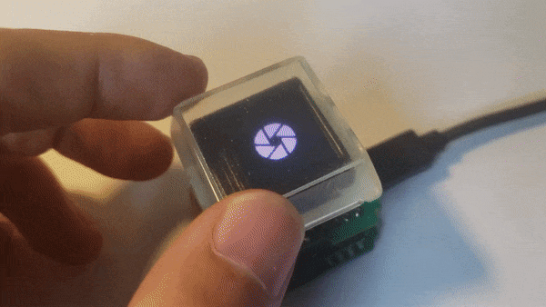
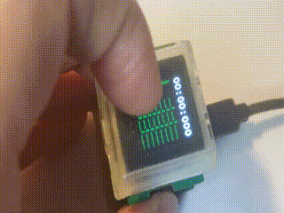
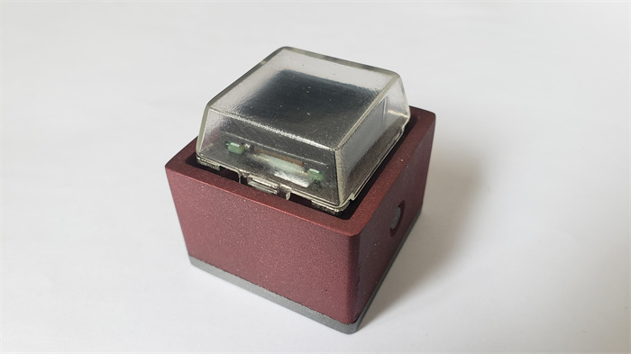
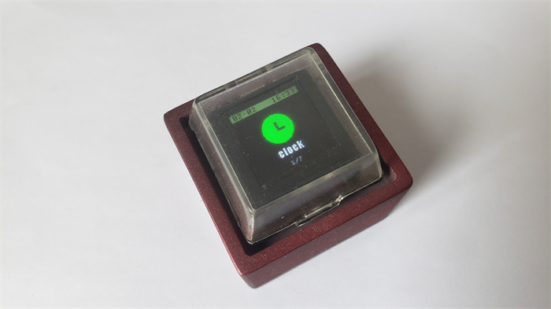
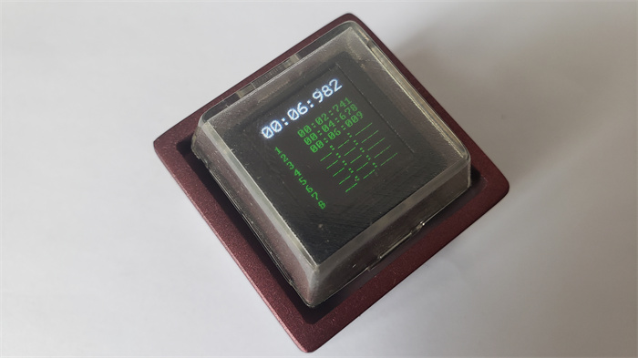
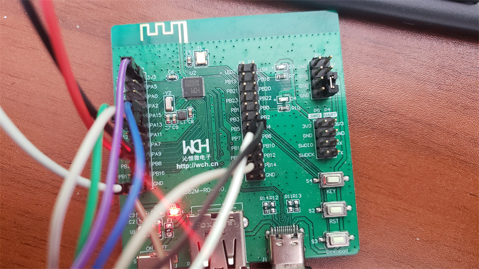
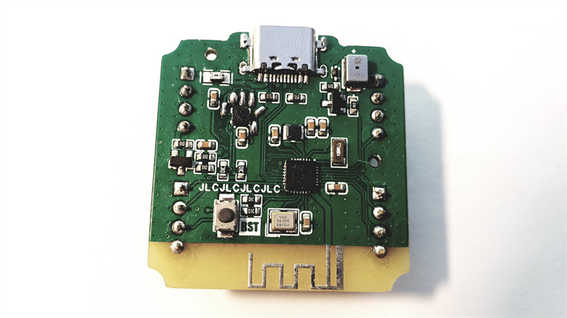
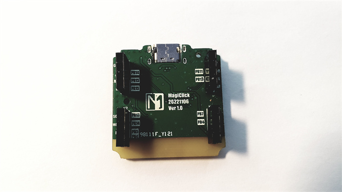
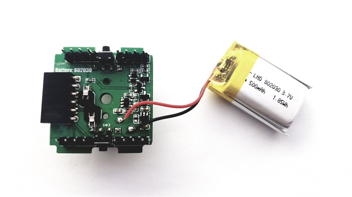

# [MagiClick](https://hackaday.io/project/188183-magiclick-a-mechanical-button-with-screen)

The project uses WCH's CH582F, a RISC-V chip, which supports BLE. The SDK comes with a multitasking system TMOS, which is very convenient for writing code.

The button can implement a variety of functions.
For example:
\- Shutter via BLE
\- Stopwatch
\- Clock
\- Pomodoro
\- Music playback controller via BLE
\- counter
\- Random numbers
\-

It includes an expansion interface to support communication with I2C devices, such as temperature and humidity monitoring, light monitoring, etc.
You can achieve more depending on your needs.

## License 

(hardware/mechanical)https://creativecommons.org/licenses/by-nc-nd/4.0

