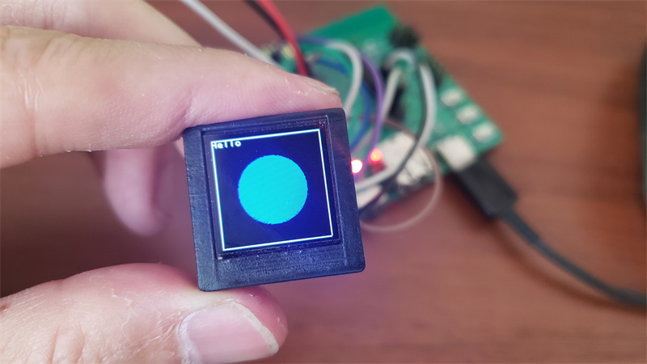

# [MagiClick](https://hackaday.io/project/188183-magiclick-a-mechanical-button-with-screen)

[GitHub - MakerM0/MagiClick: A button](https://github.com/MakerM0/MagiClick)

The project uses [WCH's CH582F](https://www.wch.cn/products/CH583.html), a RISC-V chip, which supports BLE. The SDK comes with a multitasking system TMOS, which is very convenient for writing code.

The button can implement a variety of functions.
For example:

- Shutter via BLE
- Stopwatch
- Clock
- Pomodoro
- Music playback controller via BLE
- counter
- Random numbers
- 

It includes an expansion interface to support communication with I2C devices, such as temperature and humidity monitoring, light monitoring, etc.
You can achieve more depending on your needs.

## Guide

Power on: Press and hold the left button

Power off: In the function menu interface, hit the keys three times in a row

Switch function: On the function menu interface, press the side button to switch left and right

Return to the function options page: In general, press and hold the left or right button

Enter the function: The general situation is to press and hold the middle button

Use the apk under the software folder to synchronize time

## Firmware

IDE: [MounRiver Stuido](http://www.mounriver.com/download)

### How to download the firmware

TOOL: WCHISPStudio

While holding down the right button, press the left button to turn on the power, and you can enter the download mode

## Note

The current low-power strategy is to shut down the power directly. The time is not saved after the shutdown action. Please note.

In the future, standby mode will be adopted to maintain low power consumption and time functions.

## Mechanical

The above file can be printed using a 3D printer.

The Glass cover must be transparent.

For Screen cover, black printing is recommended.

The screw hole is not used yet, please use glue to fix it.

I'll update the file that uses the screw holes when I'm free, hopefully not for too long.

## Images

## License 

(hardware/mechanical)https://creativecommons.org/licenses/by-nc-nd/4.0

