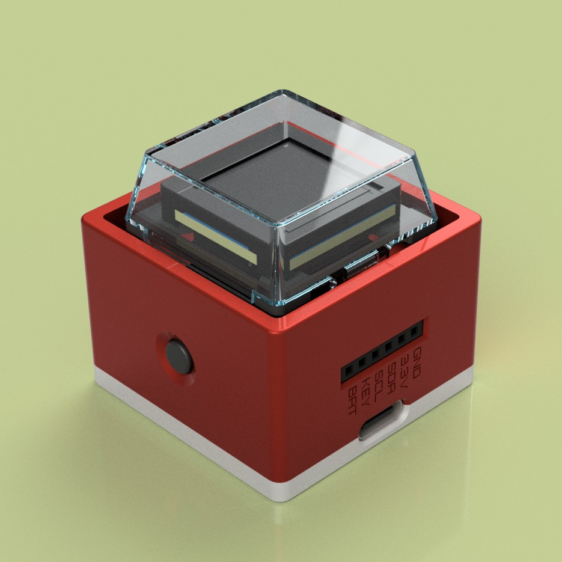
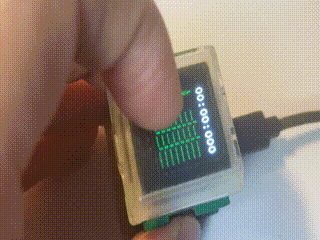
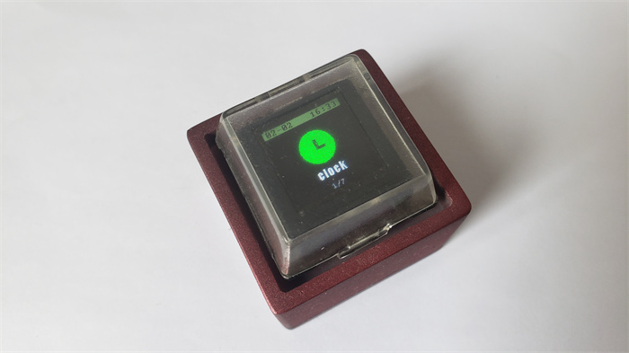

# [MagiClick](https://hackaday.io/project/188183-magiclick-a-mechanical-button-with-screen)

[GitHub - MakerM0/MagiClick: A button](https://github.com/MakerM0/MagiClick)

 

## 操作指南

开机：长按左侧按钮

关机：在功能菜单界面，三连击中键

切换功能：在功能菜单界面，按动侧面按钮进行左右切换

返回功能选项页：一般情况是长按左键或右键

进入功能：一般情况是长按中键

使用software文件夹下的apk可以进行时间同步

 

## Mechanical

 

## Images

## License 

(hardware/mechanical)https://creativecommons.org/licenses/by-nc-nd/4.0

